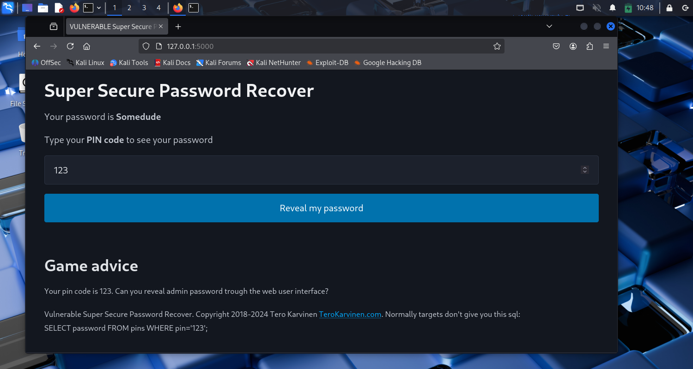

## h2 Break & unbreak (Tero)

### x) Lue/katso/kuuntele ja tiivistä.

#### OWASP: OWASP Top 10: A01 Broken Access Control
https://owasp.org/Top10/A01_2021-Broken_Access_Control/
- Broken Access Control on OWASP-järjestön haavoittuvuuksien top 10-listan ykkösenä (2021)
- Access controlin tarkoitus on varmistaa, että käyttäjä pystyy tekemään vain sellaisia toimia, joihin hänellä on tarpeelliset käyttöoikeudet
- Muutoin hyökkääjä voi esimerkiksi kokeilla suojaamattomia URL-osoitteita ja päästä näin luvatta käsiksi aineistoon
- Hyviä käytäntöjä on mm. ensin poistaa kaikki oikeudet ja antaa ne vain tarvittaviin aineistoihin, lokittaa access controliin liittyvät virheet, sekä asettaa API-kutsuille rajoituksia.

#### Karvinen 2023: Find Hidden Web Directories - Fuzz URLs with ffuf
https://terokarvinen.com/2023/fuzz-urls-find-hidden-directories/
- Ffuf on työkalu, jolla voi etsiä esimerkiksi piilotettuja nettisivuja tai POST-parametrejä
- Sen käytössä tulee olla varovainen ja varmistaa, ettei riko lakeja
- Ffuf käyttää sanalistaa URLien läpikäymiseen
- Ffufin tulostamia hakutuloksia voidaan filtteröidä esimerkiksi sivun koon perusteella, mikä voi auttaa löytämään haluttu kohdesivu.

#### PortSwigger: Access control vulnerabilities and privilege escalation
https://portswigger.net/web-security/access-control
- Käyttäjä ensin autentikoidaan eli varmennetaan, kuka hän on ja sen jälkeen session hallinnan avulla pidetään huoli siitä, että sama käyttäjä suorittaa kaikki seuraavat toiminnot
- Vertikaalinen access control varmistaa, että käyttäjä ei pääse käsiksi toimintoihin, jotka vaativat korkeammat käyttöoikeudet kuin mitä hänellä on
- Horisontaalinen access control varmistaa, että käyttäjä pääsee käsiksi vain omiin toimintoihinsa ja tietoihinsa, eikä esimerkiksi toisen samantasoisen käyttäjän tietoihin.

#### Karvinen 2006: Raportin kirjoittaminen
https://terokarvinen.com/2006/raportin-kirjoittaminen-4/
- kirjoita samalla kun teet 
- jos joku toinen tekee samat asiat raporttisi mukaan samassa ympäristössä, hänen pitää saada samanlaiset tulokset kuin sinä sait
- älä plagioi, muista kunnioittaa tekijänoikeuksia, älä sepitä jotain mitä et olet oikeasti tehnyt ja muista lähteet.

### a) Murtaudu 010-staff-only. Ks. Karvinen 2024: Hack'n Fix
https://terokarvinen.com/hack-n-fix/

Ympäristö:  
__Isäntäkone__  
11th Gen Intel(R) Core(TM) i5-11400H @ 2.70GHz (2.69 GHz)  
RAM 16,0 GB  
Windows 11 Home Version 24H2  

__Virtuaalikone__  
Oracle VirtualBox   
VirtualBox Graphical User Interface  
Version 7.1.12 r169651 (Qt6.5.3)  

__Kali Linux__    
Pre-Made Kali VirtualBox VM  
https://www.kali.org/get-kali/#kali-virtual-machines 

Ihan aluksi suoritin ``sudo apt update`` ja ``sudo apt upgrade``-komennot. Laitoin Malwarebytes-ohjelman pois päältä, koska se esti tietyn mirror-sivun käytön, eli sieltä ei lataukset onnistuneet. Sitten kun upgreidaus alkoi lopulta pyöriä, niin isäntäkoneen Firefox jämähti, ja jouduin laittamaan sen kiinni Task  Managerista. Onneksi olin alkanut kirjoittaa muistiinpanoja Githubin sijasta Notepadiin, jota tallensin pilveen.

Koska käytän Kalia, niin monet ohjeissa mainitut ohjelmat olivat jo valmiina installoituna. Huomasin myös, että kuvakaappausten tekeminen oli kätevää, eli tarvitsi vain painaa läppärin PrtSc-näppäintä, ja kuva tallentui suoraan Kalin Pictures-kansioon.

Tein kansion, johon latasin ja unzippasin tehtävätiedoston ``wget https://terokarvinen.com/hack-n-fix/teros-challenges.zip`` &  ``unzip teros-challenges.zip``.

Siirryin kansioon 010-staff-only/ ja suoritin komennon ``python3 staff-only.py``. 

Laitoin netin pois päältä ja menin selaimella osoitteeseen http://127.0.0.1:5000.

Kokeilin ohjeen mukaan laittaa PIN-koodiksi "123", ja sivusto näytti, että salasanani on "Somedude".

  

Kokeilin erilaisilla numeroyhdistelmillä, joista tuli vain vastaukseksi "not found". Jos yritin laittaa PIN-koodiksi jotain muuta kuin numeron, esimerkiksi 123'--, sain ilmoituksen, että kenttään pitää laittaa numero.

Tehtävän ohjeissa kerrottiin, että kyseinen SQL-lauseke on _SELECT password FROM pins WHERE pin ='123'_. Pohdin, että mahdollisia tapoja saada selville haluttu salasana saattaisi olla joko tulostaa kaikki salasanat, tai saada tulostettua vain sellainen salasana, joka sisältää stringin SUPERADMIN, joka oli mainittu ohjeissa.

Katsoin webbisivun lähdekoodia, mutta en nähnyt siellä mitään mikä olisi auttanut. Mietin, että mitä jos yrittäisin käyttää tunnilla tehtyä esimerkkiä, jossa sivun html-sisältöä voi muokata Inspector-ikkunassa.

Ainakin pystyin sitä kautta laittamaan tyhjään kenttään PIN-koodin 123 ja sitten klikkaaman "Reveal my password" -nappia. 

 

Jos laitoin numeroiden perään joitakin muita merkkejä, niin en saanut ruudulla valitusta siitä, että kenttään pitää laittaa vain numeroita. Jos sitten klikkasin "Reveal my password" -nappia, niin laittamani numerot+merkit katosivat kentästä, toisin kuin silloin jos laitoin pelkkiä numeroita, jolloin ne jäivät kenttään. Vastauksena näkyi "not found", eli vaikutti kuin numerot+merkit olisivat menneet läpi, mutta en ollut siitä varma. 

Kohdelause oli siis _SELECT password FROM pins WHERE pin ='123'_. Mietin, jos sitä voisi muuttaa niin, että lisää WHERE-lausekkeeseen sellaisen ehdon, että se on aina totta, esim 1=1 tai true OR true. Tai jos siihen saisi lisättyä ehdon salasanalle, esimerkiksi "password LIKE '%SUPERADMIN%'. En tosin voinut tietää, onko tietokannassa edes kenttää "password". 

Yrittelin kaikenlaisia vaihtoehtoja. Jälkikäteen ajateltuna järkevintä olisi ollut ihan ensin selvittää enemmän SQL-lausekkeista ja etenkin siitä, että missä muodossa ne pitäisi syöttää kenttään, että ne mahdollisesti menisivät oikeassa muodossa eteenpäin. Enimmäkseen vain näpyttelin kaikenlaisia vaihtoehtoja, ja todennäköisesti samoja vaihtoehtoja monta kertaa. 

#### Walkthrough - jep  
Tehtävän ratkaisu aiemmalta kurssilta: Robin Niinemets 2024,  https://askdatdude.github.io/diary/entries/diary.html?entry=SH24-002&week=  
Seuraavana päivänä, kun en uskonut, että ehtisin/pystyisin suorittamaan tehtäviä ilman isoja apuja, niin päätin katsoa valmista ratkaisua. Heti alussa näkyikin keino, johon oli viitattu vinkeissä, mutta jota en ollut ymmärtänyt itse kokeilla. Eli kun sivun lomake valitti siitä, että kenttään pitää laittaa numero, niin jos sen vaihtoi Inspector-ikkunassa kohdassa _input type="number"_ tyhjäksi, niin lomake ei sitten tarkistanutkaan syötteen laatua. 

Olin ollut siinä uskossa, että kirjoittamalla tekstin Inspector-ikkunan value-kohtaan olin pystynyt ohittamaan tuon tarkistuksen, mutta tosiasiassa testini eivät siis menneet läpi. Tarkistin tämän vielä lopuksi yrittämällä laittaa malliratkaisun SQL-lausekkeen value-kohtaan poistamatta "number"-rajoitetta, eikä se toiminut, toisin kuin malliratkaisun mukaan tehtynä.

### b) Korjaa 010-staff-only haavoittuvuus lähdekoodista. Osoita testillä, että ratkaisusi toimii. 
Aikaa oli enää vähän, mutta päätin vielä vilkaista koodia ennen kuin lunttaan valmiista ratkaisusta. Koodissa näkyi todennäköinen ongelma, eli kohta "sql = "SELECT password FROM pins WHERE pin='"+pin+"';" Siinä siis pin otetaan suoraan lomakkeelta, ja kun siihen saa oikeanlaisen SQL-lausekkeen, niin ohjelma suorittaa sen sellaisenaan. 

Googlailin SQLAlchemya, mutta en uskonut ehtiväni yrittää mitään varteenotettavaa ratkaisua, joten jätin sen tekemättä. Tutkailin valmista vastausta, jossa oli tehty toinen muuttuja "sanitoimaan" käyttäjän syöttämä pin-koodi. Pyysin ChatGPT:tä selittämään, ja ilmeisesti siinä siis tehdään niin, että SQLAlchemy-kirjaston avulla ei lähetetäkään yhtä lausetta sellaisenaan tietokantaan, vaan erikseen kyselyn rakenne ja parametrien arvot. Näin siis SQL-injektio ei toimi, koska syötettä ei käsitellä SQL-lausekkeena.

### c) Ratkaise dirfuzt-1 artikkelista Karvinen 2023: Find Hidden Web Directories - Fuzz URLs with ffuf. Tämä auttaa 020-your-eyes-only ratkaisemisessa.
https://terokarvinen.com/2023/fuzz-urls-find-hidden-directories/

Latasin tehtävän kohteen osoitteesta https://terokarvinen.com/2023/fuzz-urls-find-hidden-directories/dirfuzt-1. Annoin sitten itselleni siihen suoritusoikeuden komennolla ``chmod u+x dirfuzt-1``ja ajoin sen komennolla ``./dirfuzt-1``.

Menin selaimella osoitteeseen http://127.0.0.2:8000, ja siellä näkyi teksti Nothing, nil, null, nada.

 

Latasin sanakirjan komennolla ``wget https://raw.githubusercontent.com/danielmiessler/SecLists/master/Discovery/Web-Content/common.txt``.

Laitoin netin pois päältä.

Suoritin ffufin komennolla ``ffuf -w common.txt -u http://127.0.0.2:8000/FUZZ``. Yritin ensin ajaa sitä samassa komentokehoteikkunassa, kunnes muistin, että piti avata toinen ikkuna.

Tuloksissa näkyi, että joidenkin sivujen koko oli erilainen, ja niissä oli eri määrä sanoja tai rivejä.  Filtteröin tuloksia pituuden mukaan, ja koska 154 oli yleinen pituus, niin käytin sitä filtteriehtona. ``ffuf -w common.txt -u http://127.0.0.2:8000/FUZZ -fs 154``

Sillä tuli lyhyt lista, jossa komeili wp-admin, jonka curlasin ja katsoin myös selaimessa, eli kohde oli löytynyt.

 

Filtteröidyissä tuloksissa näkyi myös .git-alkuisia sivuja, joista löytyi ratkaisu versionhallintaan liittyväksi kohteeksi.
 

### d) Murtaudu 020-your-eyes-only. Ks. Karvinen 2024: Hack'n Fix
https://terokarvinen.com/hack-n-fix/

Kalissa oli valmiina installoituna virtualenv ja django, joten menin oikeaan kansioon ja aktivoin virtualenvin.  Laitoin netin pois päältä, siirryin vielä kansioon logtin ja käynnistin palvelimen komennolla ``./manage.py runserver``. Osoitteessa http://127.0.0.1:8000/, näkyi nyt teksti Hello! ja kaksi nappia.

Fuzzasin sivun ffufilla. Filtteriksi laitoin yhdeksän sanaa, ja sillä löytyi mielenkiintoiselta sivu admin-console. Tämän pidemmälle en kyllä sitten päässytkään, koska aika loppui. 

 

Katsoin sitten malliratkaisusta, eli rekisteröin tunnuksen, ja sillä pääsin suoraan kyseiselle admin-console-sivulle, kun laitoin sen osoitteeksi. 

### e) Korjaa 020-your-eyes-only haavoittuvuus. Osoita testillä, että ratkaisusi toimii.
Tätä en tehnyt lainkaan, koska olin jo vilkaissut sen ratkaisua.

### g) Vapaaehtoinen. Johdantotehtävä, joka auttaa 010-staff-only ratkaisemisessa. Ratkaise Portswigger Academyn "Lab: SQL injection vulnerability in WHERE clause allowing retrieval of hidden data".
https://portswigger.net/web-security/sql-injection/lab-retrieve-hidden-data

Labratehtävässä piti tehdä SQL-injektiohyökkäys, jolla sovellus näyttää yhden tai useamman "unreleased" tuotteen. Tehtävässä oli annettu SQL-komento _SELECT * FROM products WHERE category = 'Gifts' AND released = 1_, jolla sovellus hakee kategorian, kun käyttäjä valitsee sen. 

Sivulla näkyi tuotteita, ja niiden yläpuolella teksti "Refine your search:" ja siinä muutamia kategorioita, mm. "Corporate gifts". Kokeilin laittaa pelkän "Gifts" URL-osoitteeksi, mutta silloin ei näkynyt mitään. 

Sivulla https://portswigger.net/web-security/sql-injection oli esimerkki, jossa Gifts-sanan perään laitettuna "'--" tekee SQL:n loppulausekkeesta kommentin, eli sitä ei oteta huomioon. Tässä tapauksessa siis "AND Released=1" jätettäisin huomoimatta.

Yritin laittaa Corporate gifts:n jälkeen "'--", ja sitten painoin Enter. Sivulle ilmestyi ainakin yksi uusi tuote, eli jotain oli tapahtunut. Labra ei silti näyttänyt, että se olisi mennyt läpi. Käytin sitten sivulta https://portswigger.net/web-security/sql-injection löytynyttä toista kikkaa "Gifts'+OR+1=1--", ja tuotteita näkyi paljon enemmän. Labra näkyi nyt menneen läpi. 

Ensimmäisellä kikalla sivusto siis näytti lahjat ja myös "unreleased" lahjat, mutta toisella kikalla se näytti kaikki tuotteet, mukaan lukien "unreleased" tuotteet. Mielestäni ensimmäinenkin kikka jo ratkaisi tehtävän, koska siinä näytettiin yksi lahja enemmän. 

Myöhemmin kun kokeilin samaa labratehtävää uudelleen, niin nyt sivulla näkyikin Gifts eikä Corporate Gifts. Sivusto käyttäytyi samalla tavalla, eli ensimmäisellä kikalla se näytti yhden lahjan lisää, ja toisella kaikki tuotteet, ja vasta toinen tapa ratkaisi labran.

### h) Vapaaehtoinen. Johdantotehtävä, joka auttaa 010-staff-only ratkaisemisessa. Ratkaise Portswigger Academyn "Lab: SQL injection vulnerability allowing login bypass"
https://portswigger.net/web-security/sql-injection/lab-login-bypass

Menin kohtaan "My account". Siitä pääsin login-sivulle, jossa piti laittaa käyttäjänimi ja salasana. Olin lukenut sivun https://portswigger.net/web-security/sql-injection, jossa suoraan annettiin kyseinen kikka, eli laitoin käyttäjänimen kohdalle _administrator'--_. Laitoin salasanaksi jotain satunnaista siltä varalta, että siihen ei voisi jättää tyhjää salasanaa. Painoin login-nappia, ja labra ilmoitti, että tehtävä on suoritettu onnistuneesti.
