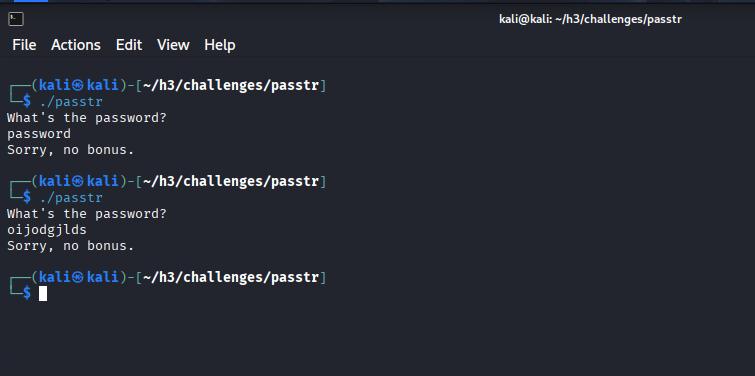
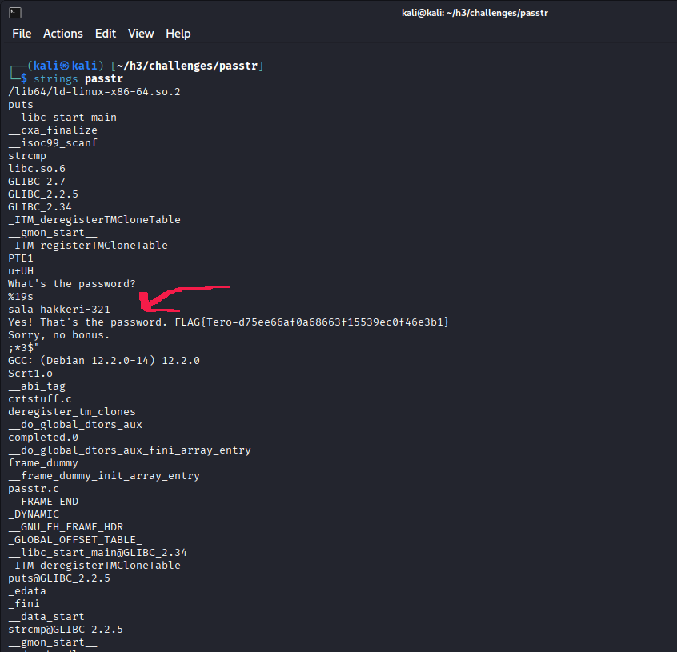
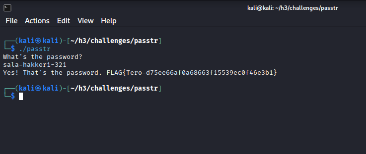
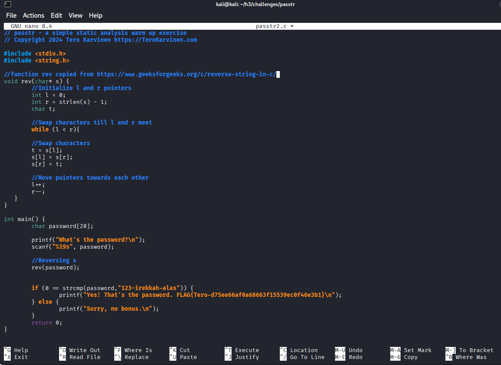
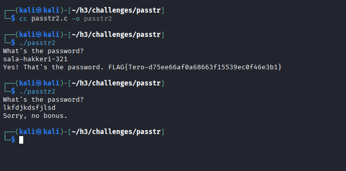
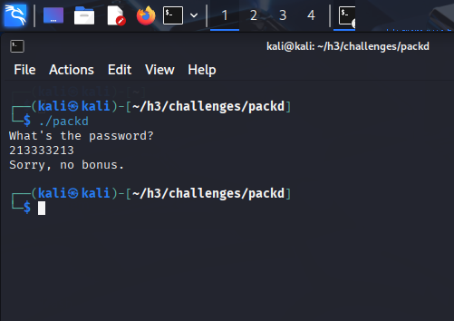
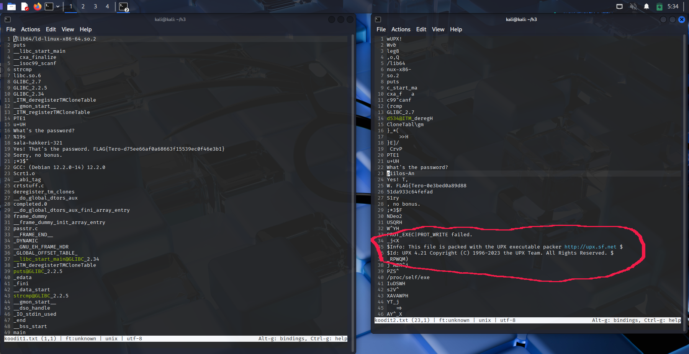
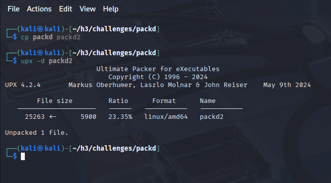
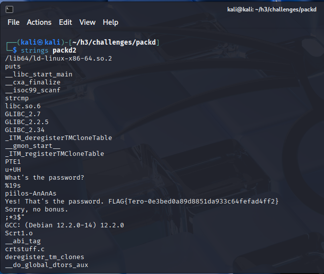
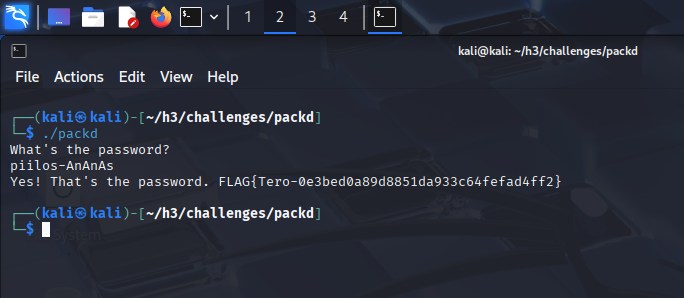

## h3 No strings attached (Tero)
Ympäristö:  
11th Gen Intel(R) Core(TM) i5-11400H @ 2.70GHz (2.69 GHz)  
RAM 16,0 GB  
Windows 11 Home Version 24H2  

Oracle VirtualBox  
VirtualBox Graphical User Interface  
Version 7.1.12 r169651 (Qt6.5.3)  

Kali Linux  
Pre-Made Kali VirtualBox VM  

Tehtävät: https://terokarvinen.com/sovellusten-hakkerointi/#h3-no-strings-attached-tero

### a) Strings. Lataa ezbin-challenges.zip Aja 'passtr'. Selvitä oikea salasana 'strings' avulla. Selvitä myös lippu. (Ensisijaisesti katsomatta sorsia, jos osaat.)

Latasin ezbin-challenges.zip-tiedoston ja ajoin sen sisältämän passtr-tiedoston komennolla `./passtr`.



Strings-työkalun komennolla `strings passtr` salasana näkyi suoraan binäärikoodista.

  
Suoritin ohjelman, laitoin siihen koodissa näkyneen salasanan ja tehtävä ratkesi.



FLAG{Tero-d75ee66af0a68663f15539ec0f46e3b1}
  
### b) Tee passtr.c -ohjelmasta uusi versio, jossa salasana ei näy suoraan sellaisenaan binääristä. Osoita testillä, että salasana ei näy. (Obfuskointi riittää.)

Etsin tietoa obfuskoinnista ja mietin esimerkiksi Caesar Cipher -metodia (https://www.geeksforgeeks.org/ethical-hacking/caesar-cipher-in-cryptography/), jolla salasanan saisi "sekoitettua" niin, että salasana ei näy suoraan binäärikoodista. Tai jos siihen pystyisi käyttämään define-sanaa jotenkin niin, että salasana ei näkyisi itse koodissa. (https://www.techonthenet.com/c_language/constants/create_define.php).

Pidin pidemmän tauon, ja tauon jälkeen päätin tehdä yksinkertaisen version, jossa käyttäjän antama salasana käännetään takaperin, ja sitä verrataan oikean salasanan takaperoiseen muotoon. Käytin valmista koodia, jonka löysin sivulta https://www.geeksforgeeks.org/c/reverse-string-in-c/.

Käyttäjän antama salasana siis käännetään takaperin, ja käännettyä versiota verrataan takaperoiseen salasanaan "123-irekkah-alas". Ei kovin kummoinen obfuskointi, mutta vaikeammalla salasanalla sitä olisi ainakin hitusen vaikeampi suoraan huomata.



Koodin muokkaamista varten olin tehnyt alkuperäisestä passtr.c-koodista kopion "passtr2.c". Käänsin sen komennolla ``cc passtr2.c -o passtr2``. Sitten ajoin muokkaamani koodin ja tarkistin, että se toimi oikealla salasanalla (eikä toiminut, jos salasana oli väärä).



### c) Packd. Aja 'packd' paketista ezbin-challenges.zip. Mikä on salasana? Mikä on lippu? (Tämä tehtävä on hieman haastavampi. Kirjaa ylös kokeilemasi lähestymistavat ja keksimäsi hypoteesit. Toivottavasti pääset itse maaliin, mutta jos et, läpikävely paljastuu tunnilla...)

Packd-ohjelman toiminta vaikutti samanlaiselta kuin ensimmäisen tehtävän passtr, eli kysytään salasana ja tarkistetaan, oliko se oikein.



Tein saman kuin ensimmäisen tehtävän kohdalla, eli katsoin strings-työkalulla, mitä binäärikoodista saisi irti.

Stringsillä näkyi samalla tavalla "What's the password?", mutta seuraavat rivit eivät olleetkaan yhtä selkeitä kuin ensimmäisessä tehtävässä (lipun kohta on "tyhjennetty"):

```
What's the password?
piilos-An
Yes! T,
W. {FLAG...
.....
S1ry
, no bonus.
```

Koodissa näkyi siis samantyyppistä tekstiä kuin ensimmäisessä ohjelmassa, mutta esimerkiksi "Sorry"-sanan sijaan lukee "S1ry", ja lippu vaikuttaa puutteelliselta, koska sen lopusta puuttuu aaltosulje, eli koodia on varmaankin jollain tavalla muutettu. 

Mietin, että koska ohjelmat vaikuttavat toimivan samalla tavalla, niin niiden koodit saattavat olla samantyyppisiä, joten päätin verrata niitä keskenään. Kiinnitin myös huomiota siihen, että ohjelman nimi oli "packd", mikä saattaisi viitata jonkinlaiseen tiedoston pakkaamiseen.



Koodissa näkyikin kohta "This file is packed with the UPX executable packer http://upx.sf.net", mitä ei näkynyt ensimmäisen ohjelman binäärissä.

Googlasin ensin tietoa UPX-ohjelmasta varmistaakseni, että se on turvallinen. Menin sitten kyseiselle nettisivulle ja latasin ohjelman osoitteesta https://github.com/upx/upx/releases/tag/v5.0.2 (suora linkki https://github.com/upx/upx/releases/download/v5.0.2/upx-5.0.2-amd64_linux.tar.xz). 

Tein alkuperäisestä packd-tiedostosta kopion "packd2 ja suoritin komennon `upx -d packd2`, jolla tiedosto palautetaan pakkaamattomaan muotoon.



Katsoin strings-työkalulla pakkaamattoman packd2-tiedoston binäärikoodia:



Nyt siellä näkyikin salasana ja kokonainen lippu.

Suoritin alkuperäisen packd-ohjelman ja totesin, että binääristä löytynyt salasana oli oikea:



FLAG{Tero-0e3bed0a89d8851da933c64fefad4ff2}

Käytettyjä taustalähteitä:  
https://linuxize.com/post/how-to-extract-unzip-tar-xz-file/   Tar-tiedoston käsittelystä  
https://www.geeksforgeeks.org/cpp/how-to-compile-and-run-a-c-c-code-in-linux/ C-kielisen ohjelman ajaminen
