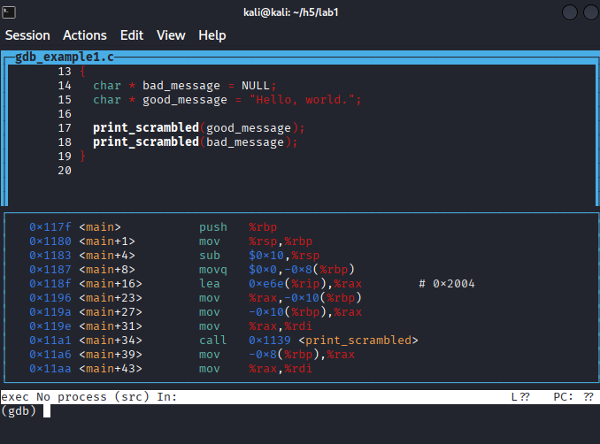
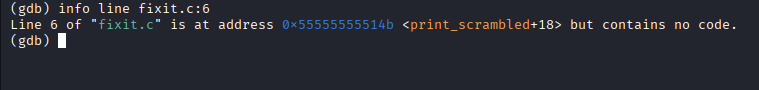
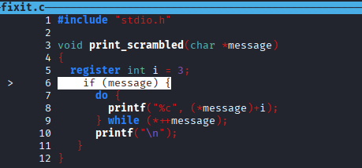
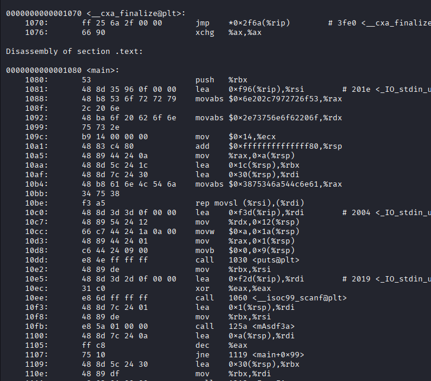

## h5 Se elää! (Lari)

### a) Lab1. Tutkiminen mikä on ohjelmassa vialla ja miten se korjataan. 

En syysflunssa takia päässyt luennolle, joten tutustuin debuggaukseen itsekseni. YouTubesta löytyi video, joka esitti graafisen tavan käydä läpi yhtä aikaa lähdekoodia että assemblyä. https://www.youtube.com/watch?v=Dq8l1_-QgAc

Katsoin Lab0:aa, joka oli ratkaistu tunnilla, ja siinä ilmeisesti oli bugi, minkä takia laskuri meni viimeisessä kohdassa nollaann

Latasin tehtävän Lab1, jossa oli sisällä sekä lähdekoodi että binääri. 

Asensin gdb:n ja avasin tiedoston debuggerissa komennolla __gdb ./gdb_example1__

Videon ohjeiden mukaan avasin tiedoston näkymään, jossa yläpuolella näkyi lähdekoodi ja alhaalla assembly. __layout split__

Asetin keskeytyspisteen main-ohjelman alkuun __break main__ ja ajoin sitten ohjelman komennolla __run__. Komennolla __next__ pääsin yhden rivin eteenpäin lähdekoodissa ja komennolla __step__ yhden rivin assemblyssä. 

Kun pääsin lähdekoodissa riville 18 niin näin, että ohjelma tulosti "#zruog1#. Lähdekoodissa luki silloin print_scrambled(bad_message);. 

Step-askelilla pääsin print_srambled-funktioon. Funktiolla on parametri char *message, jossa * tarkoittanee taas pointteria, eli konseptia johon en vielä ole ihan päässyt sisälle.

Menin nextillä eteenpäin, ja nyt ohjelma printtasi "Program received signal SIGSEV, Segmentation fault. Sitten se printtasi jonkin heksadesimaaliluvun, joka kaiketi on vain assembly-koodin rivi, ja siinä se ilmoitti että funktiossa "print_scrambled" (message=0x0) koodin rivillä 7 on ongelma.

Lähdekoodissa on ensin funktio print_scrambled, joka saa parametrinä char-tyyppisen viestin, ja sitten do-while-loopissa tulostetaan viesti "skrämblättynä" niin, että alkuperäisen merkin sijasta tulostetaan kolmen merkin päässä oleva merkki, eli esimerkiksi a:n sijasta tulostettaisiin d.

Kun ohjelmaa ajoi, se ensin tulosti Khoor/#zruog1, eli ohjelman "good_message"-muuttujan arvon "Hello, world." skrämblättynä. Ja sitten ohjelma taas kaatui, kun se oli print_scrambled-funktiossa rivillä 7: printf("%c", (*message)+i); Tässä kohtaa ohjelma saa parametriksi bad_message-muuttujan, joka on NULL.

"while (*++message)" näytti oudolta syntaksilta, mutta ChatGPT:n mukaan se on täysin normaalia, ja tarkoittaa sitä, että do-kohtaa toteutetaan niin kauan, kunnes tullaan lopetusmerkkiin '\0'. 

Virheilmoitus tulostui siis rivillä 7. Ehkei ole järkeä skrämblätä viestiä, jota ei ole.

Tein ohjelmasta kopion ja yritin korjata ongelman. Pari omaa kokeiluani epäonnistui, ensin virheilmoitukseen "comparison between pointer and interger", kun olin tehnyt tarkistuksen "if (message != NULL). Sitten kokeilin  if (sizeof(*message > 0))., jolloin ohjelma hyppäsi koko rivin yli. Kysyin lopulta asiaa GPT:ltä, ja se selitti, että kyseessä on sellainen rakenne, että se on aina true, ja siksi ohjelman kääntäjä ei välitä siitä. ChatGPT:n neuvolla __info line fixit.c:6__  näinkin, että kyseisen rivin assembly-koodissa ei ollut mitään. 

Korjasin koodin ChatGPT:n ohjeella lisäämällä tarkistuksen __if (message)__, eli ensin tarkistetaan, että viesti ei ole tyhjä.

Lopuksi testasin korjaamattomalla "gyksi"-ohjelmalla ja korjatulla "fiksu"-ohjelmalla, että bugi oli korjattu.

### b) Lab2. Selvitä salasana ja lippu + kirjoita raportti siitä miten aukesi. 

Lab2-zip-tiedostossa näytti olevan sama ohjelma kuin aiemmassa tehtävässä eli passtr. Lisäksi siellä oli binääritiedosto passtr2o. READMED.md-tiedostossa kehotettiin selvittämään sen salasana. Ohjelma toimi samalla tavalla kuin passtr, eli kysyi "What's the password" ja sen jälkeen tarkisti sen.

Passtr2o-tiedoston mukana siis ei ollut lähdekoodia mukana vaan pelkkä binääri.  Stringsillä binääristä löytyi tuttu "What's the password?" ja muun muassa "check_passord".

Komennolla __objdump -d passtr2o__ näkyi kaikenlaista.

Olin aika pihalla ja kyselin ChatGPT:ltä erilaisia komentoja, joita kokeilin.

En malttanut tutustua teoria-asioihin kunnolla, vaan enimmäkseen tappelin ChatGPT:n kanssa, jotta se selittäisi miten saisin esimerkiksi tutustuttua assemblyyn ilman, että koodi ajetaan ja ohjelma loppuu. Jossain vaiheessa sainkin sen toimimaan. Seuraavana päivänä vahingossa keksin, että assembly-ikkunaa pystyy skrollaamaan nuolinäppäimillä. Lopulta luovutin.

### c) Lab3. Kokeile Nora Crackmes harjoituksia tehtävä 3 ja 4 ja loput vapaaehtoisia. Tindall 2023: NoraCodes / crackmes.
Luin Nora Crackmes -sivun ohjeista, että nämä tehtävät pitäisi tehdä ilman lähdekoodia. Kolmostehtävästä salasanan näkikin suoraan koodista. Vilkaisin binääriä debuggerissa, mutta en päässyt oikein mihinkään ja luovutin.
