## h4 Kääntöpaikka (Tero)

### x) Lue/katso/kuuntele ja tiivistä. (Tässä x-alakohdassa ei tarvitse tehdä testejä tietokoneella, vain lukeminen tai kuunteleminen ja tiivistelmä riittää. Tiivistämiseen riittää muutama ranskalainen viiva.)

Hammond 2022: https://www.youtube.com/watch?v=oTD_ki86c9I Ghidra for Reverse Engineering (PicoCTF 2022 #42 'bbbloat') (Video, noin 20 min)
- videossa esitellään joitakin käänteismallintamisen työkaluja
- ltracella voi etsiä kirjastokutsuja ja stracella joitakin muita kutsuja tiedoston koodista
- obdjump-työkalulla voi myös vilkaista koodia ennen kuin käyttää monimutkaisempaa kuten esim. Ghidra
- Ghidra tekee binääristä lähdekoodin tyyppistä koodia ja näyttää myös assembly-koodin, joista voi yrittää selvittää ohjelman toimintaan
- Ghidra muun muassa erottelee funktiot toisistaan 

__Ympäristö:__
- 11th Gen Intel(R) Core(TM) i5-11400H @ 2.70GHz (2.69 GHz)
- RAM 16,0 GB
- Windows 11 Home Version 24H2

- Oracle VirtualBox
- VirtualBox Graphical User Interface Version 7.1.12 r169651 (Qt6.5.3)

- Kali Linux 

### a) Asenna Ghidra.
Ghidra asennettiin jo tunnilla.

### b) rever-C. Käänteismallinna packd-binääri C-kielelle Ghidralla. Etsi pääohjelma. Anna muuttujille kuvaavat nimet. Selitä ohjelman toiminta. Ratkaise tehtävä binääristä, ilman alkuperäistä lähdekoodia. 

Latasin packd-binäärin Ghidraan, ja jonkin aikaa koodia ihmeteltyäni muistin, että tiedosto on pakattu. Suoritin komennon __upx -d packd__, ja aikaisemmin asentamani Upx-ohjelma palautti tiedoston pakkaamattomaan muotoon.

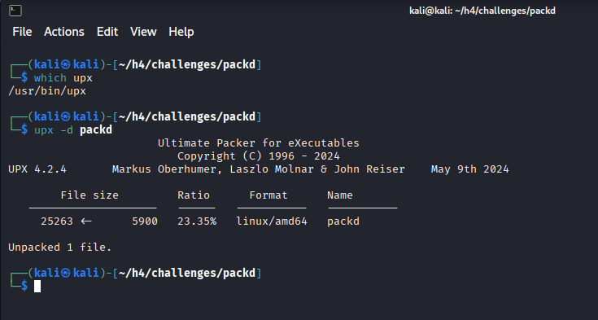

Latasin tiedoston uudelleen Ghidraan, ja pääohjelma löytyi helposti.

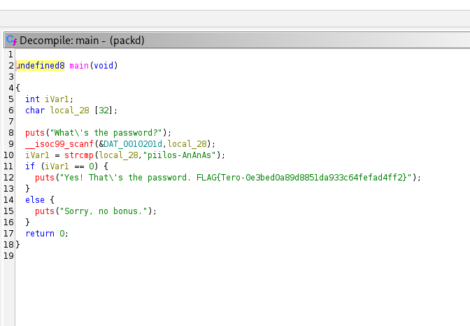

Muutin muuttujien nimet suoraan Decompile-ikkunassa.

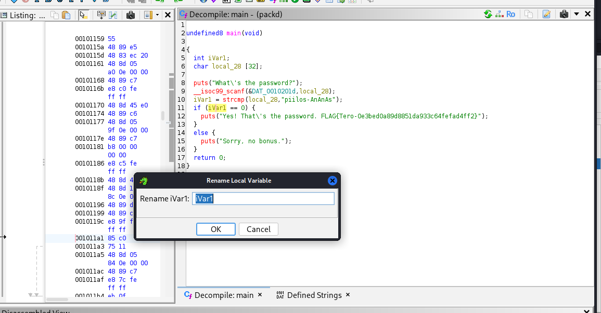

Ohjelman toiminta riveittäin:  
5. määritellään int-tyyppinen muttuja checkPassword, johon talletetaan tieto siitä, onko salasanan tarkistus mennyt läpi  
6. char-tyyppinen taulukko userPassword, johon luetaan käyttäjän antama salasana  
8. printataan ruudulle "What's the password?"  
9. scanf-funktiolla luetaan annettu salasana  (Lähde: 
https://www.geeksforgeeks.org/c/scanf-in-c/ )
10. checkpassWord-muuttujaan talletetaan tulos strcmp-funktiosta. Funktio vertaa käyttäjän antamaa salasanaa userPassword oikeaan salasanaan "piilos-AnAnAs"  
11. tarkistetaan if-lauseen ehto, eli jos funktio strcmp antoi tulokseksi nollan, se tarkoittaa että sen vertaamat stringit olivat samanlaiset.   
12. Tulostetaan tieto, että salasana oli oikein  
14. else-lohkoon mennään, jos if-lause ei ollut totta  
15. tällöin tulostetaan tieto, että salasana oli väärin  
17. main-ohjelma palauttaa nollan, kun ohjelman suoritus on päättynyt.  

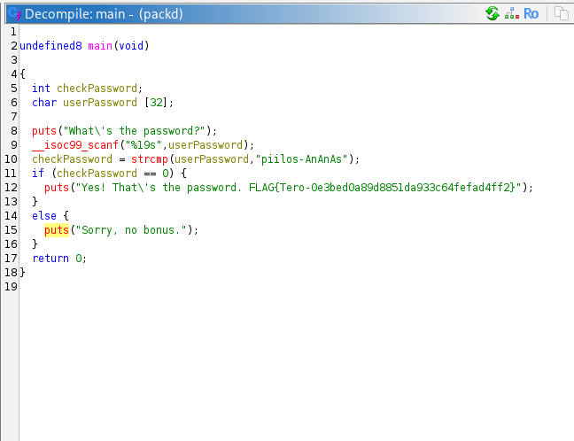

### c) Jos väärinpäin. Muokkaa passtr-ohjelman binääriä (ilman alkuperäistä lähdekoodia) niin, että se hyväksyy kaikki salasanat paitsi oikean. Osoita testein, että ohjelma toimii. ezbin-challenges.zip

Latasin passtr-binääri Ghidraan, ja etsin pääohjelman, jonka Ghidra olikin nimennyt main-funktioksi. 

Etsin assembly-ikkunasta kohdan, jossa oli JNZ, ja muutin siihen JZ. Näin tehtyäni decompiler-ikkunassa näkyi, että koodi oli muuttunut niin, että if-else-rakenteen tarkistamien ehtojen lopputulokset kääntyivät päinvastaisiksi.

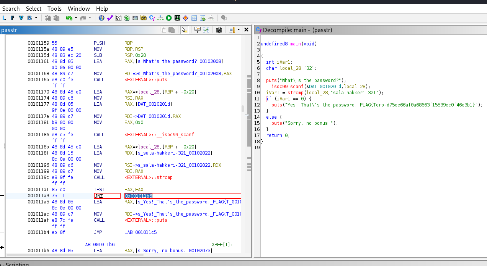

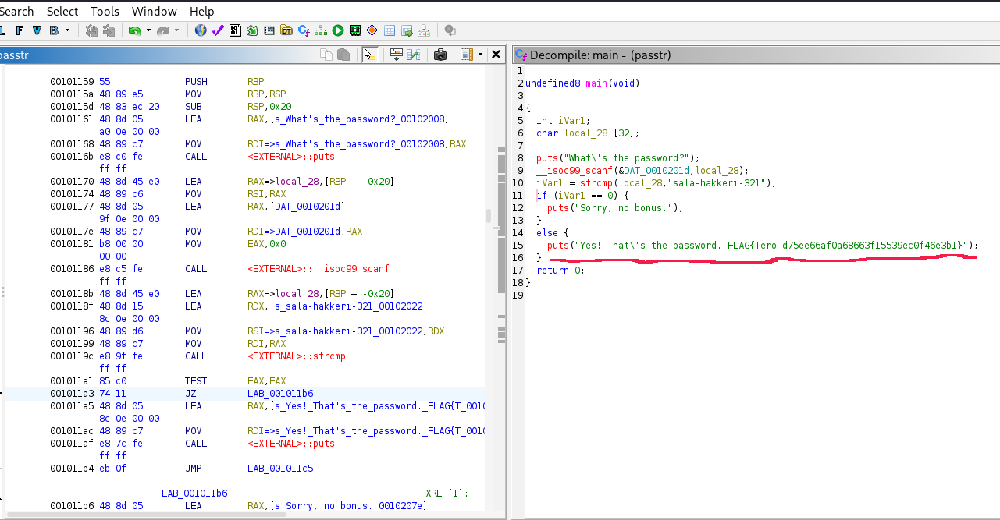

Exporttasin binäärin uudelle nimelle. Jotta binäärin pystyisi suorittamaan, niin annoin sille suoritusoikeuden komennolla __chmod +x__.

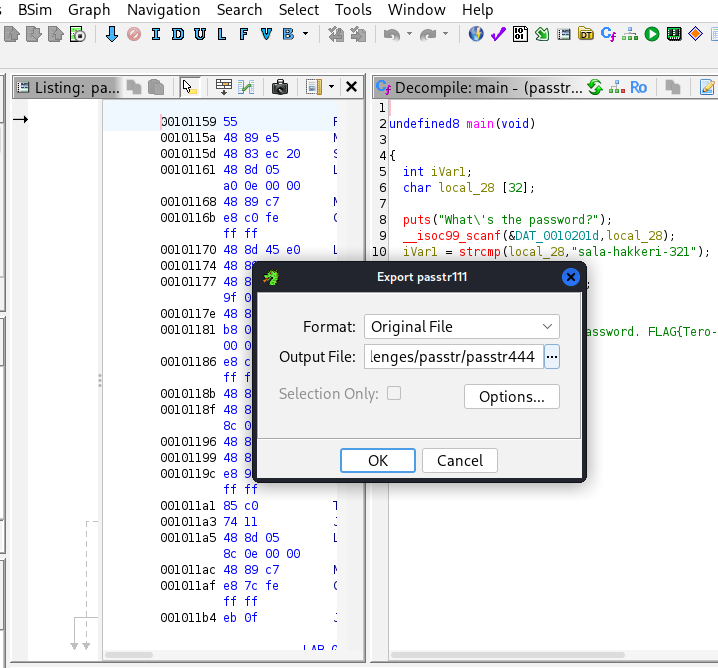

Sen jälkeen suoritin ohjelman komennolla __./passtr444__. Ohjelma hyväksyi nyt erilaisia salasanoja, mutta se ei hyväksynyt alkuperäistä oikeaa salasanaa "sala-hakkeri-321".

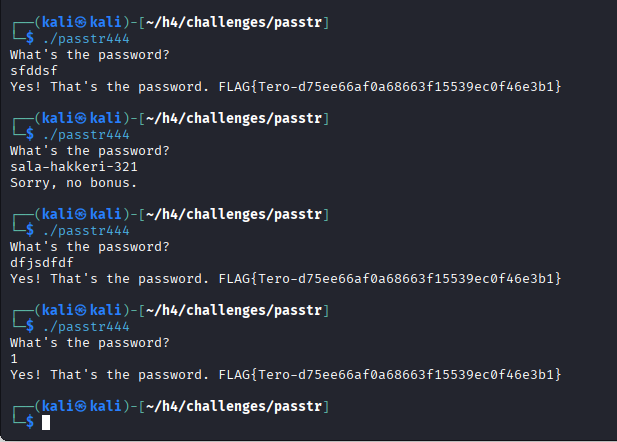

### d) Nora CrackMe: Käännä binääreiksi Tindall 2023: NoraCodes / crackmes. Lue README.md: älä katso lähdekoodeja, ellet tarvitse niitä apupyöriksi. Näissä tehtävissä binäärejä käänteismallinnetaan. Binäärejä ei muokata, koska muutenhan jokaisen tehtävän ratkaisu olisi vaihtaa palautusarvoksi "return 0".

Latasin .c-tiedostot osoitteesta https://github.com/NoraCodes/crackmes. Sivuston README.md-ohjeiden mukaisesti käänsin tiedostot komennolla __make tiedosto__

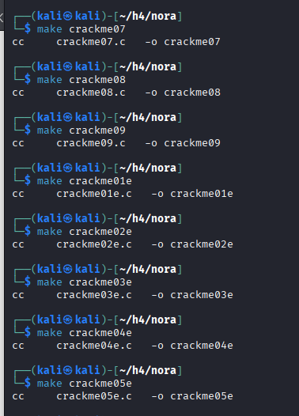

## e) Nora crackme01. Ratkaise binääri.

Analysoin crackme01-tiedoston Ghidralla, joka löysi suoraan main-funktion.

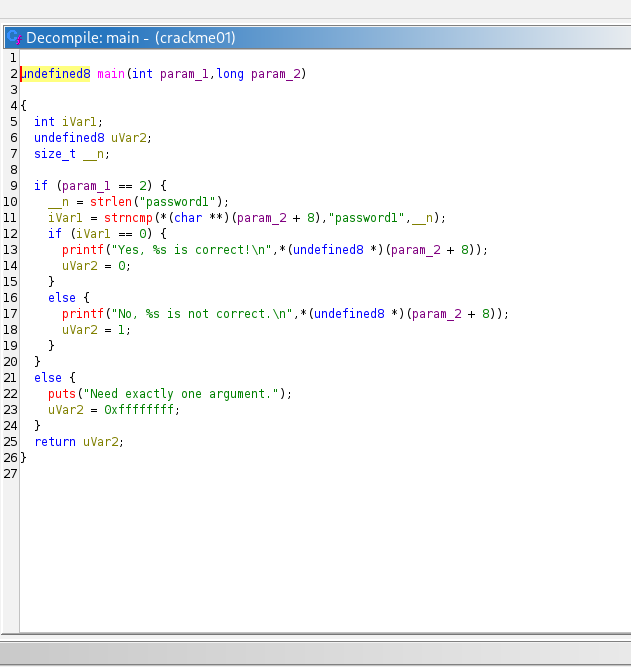

Koodissa näkyy, että ohjelmassa verrataan strncmp-funktiolla käyttäjän antamaa salasanaa oikeaan salasanaan "password1". 

Else-kohdassa sanotaan "Need exactly one argument.", mistä voisi päätellä että ohjelmalle pitää siis antaa yksi argumentti eli se salasana.

Laitoin ohjelmalle argumentiksi "salasana1", ja ohjelma meni läpi.

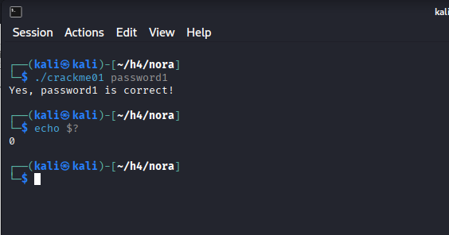

### e) Nora crackme01e. Ratkaise binääri.

Main-metodi löytyi taas helposti Ghidralla. 

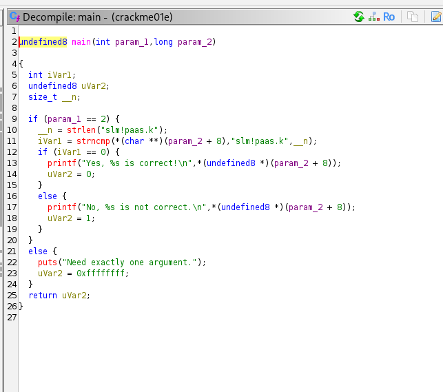

Ohjelma näytti samanlaiselta kuin edellisessä tehtävässä. Salasanan kohdalla oli nyt "slm!paas.k". Yritin laittaa sen ohjelman parametriksi, mutta se ei toiminut. Kun sitten katsoin edellisiä komentoja nuolinäppäimellä, niin huomasin, että näytti siltä kuin ohjelma olisi ottanut sisään vain salasanan "slm"-alun, eli antamani komento oli "make slm".

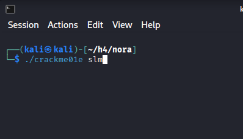

Ohjelma ei siis huomioinut koko salasanaa. Muistelin, että merkillä \ voi koodiin lisätä erikoismerkkejä, jotka muuten sekoittaisivat koodin toiminnan. Kokeilin siis komennolla __make slm\!paas.k__, ja ohjelma meni sillä läpi.

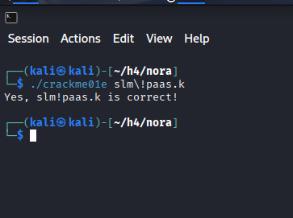

### f) Nora crackme02. Nimeä pääohjelman muuttujat käänteismallinnetusta binääristä ja selitä ohjelman toiminta. Ratkaise binääri.

Tämän ohjelman koodi näytti monimutkaisemmalta kuin edellisten. Yritin selvittää koodissa näkyviä *-kohtia, jotka ilmeisesti ovat "pointtereita", jotka osoittavat muuttujiin. En päässyt kovin syvälle ymmärryksen tasolle niiden kanssa. (https://www.geeksforgeeks.org/c/c-pointer-to-pointer-double-pointer/)

Mutta tässä koodissa niistä ei kai tarvitse edes välittää, vaan tärkein kohta koodissa on rivillä 12 eli `"password1[local_c] + -1 !=`. Eli siinä tarkistetaan, että jos password-jotain ei ole sitä mihin verrataan, niin tulostetaan että salasana on väärin.

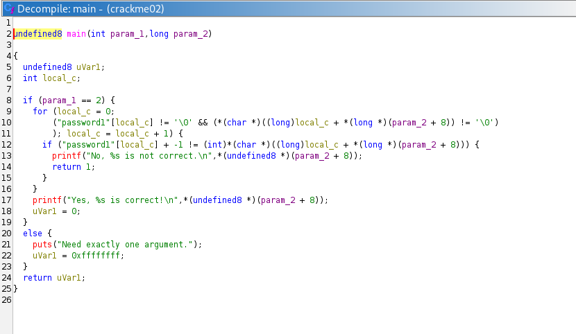

"password"[local_c] tarkoittaa password-sanan merkkiä kohdassa "local_c". Sitten käytinkin ihan liikaa aikaa pähkäilemään, että miten siitä vähennetään luku yksi. Olin jo jossain vaiheessa aika lähellä ratkaisua, mutta jäin jumiin kirjaimeen a, eli miten a:sta voi vähentää yhden tai siis mennä a-kirjaimesta yhden vasemmalle. 

Pähkimisen sijasta olisi kannattanut yrittää oikeasti selvittää asiaa esimerkiksi googlaamalla. Lopulta kysyin ChatGPT:ltä, joka kertoi, että ennen a:ta on merkki "`". Se olisi löytynyt esimerkiksi tältä sivulta: https://www.eso.org/~ndelmott/ascii.html. 

Oikea salasana oli siis sellainen, jossa jokaista "password1" sanan kirjain muutettiin ASCII-listalla yhden vasemmalle.

Muutin Decompile-ikkunassa muuttujien nimet selkeämpään muotoon.

Ohjelman toiminta:    
2: int params - tässä ohjelmalle annetaan parametrien määrä. Kun parametrejä on kaksi, se tarkoittaa että komentorivillä on annettu ohjelman nimi ja yksi parametri, eli tässä ohjelmassa salasana   
long givenPassword - tässä annetaan pointteri argumenttiin eli annettuun salasanaan (Lähde: https://www.montana.edu/rmaher/ee475_fl04/Command_line.pdf )
8. if-lauseessa tarkistetaan, annettiinko parametrejä kaksi, mikä on ohjelman toimimisen edelletys  
9. for-silmukan avulla käydään läpi annettu salasana merkki merkiltä, eli aloitetaan nollasta ja jatketaan niin kauan, kunnes tullaan lopetusmerkkiin \0  
11. toisessa if-lauseessa verrataan jokaista käyttäjän antamaa salasanaa oikeaan salasanaan, mutta ei suoraan, vaan niin että oikean salasanan n:s merkki muutetaan merkiksi ennen kyseistä merkkiä, ja verrataan sitten sitä samassa kohdassa olevaan merkkiin käyttäjän antamassa salasanassa.   
12. Jos if-lause ei ollut totta, niin ohjelma loppuu ja tulostetaan tieto siitä, että salasana ei ollut oikea (koska tässä siis verrattiin sitä, että salasanat eivät täsmää eli !=  
16. Muussa tapauksessa, eli jos salasana oli oikein, tulostetaan tieto, että se oli totta.  
19. else-kohtaan päädytään, jos parametrejä ei ollut kaksi  
23. Lopulta palautetaan int-tyyppinen muuttuja passCheck.  

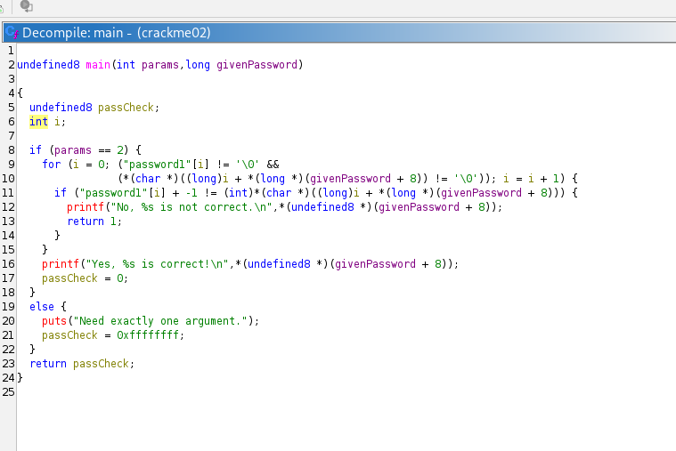

    
