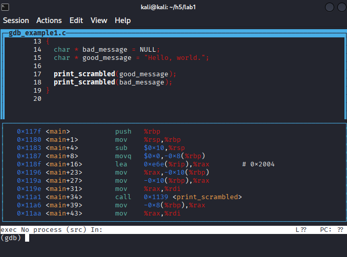
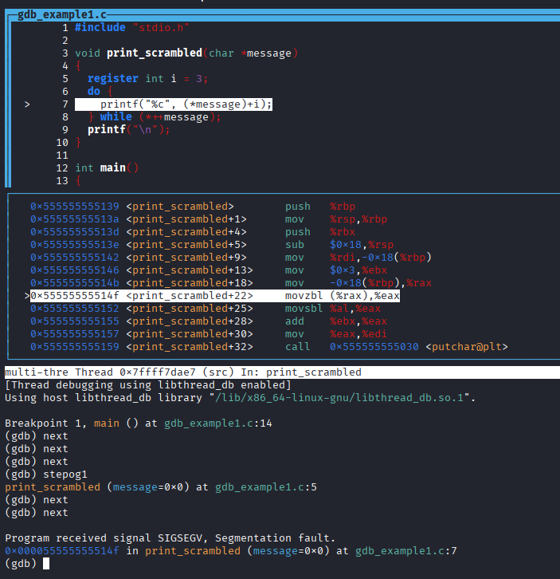
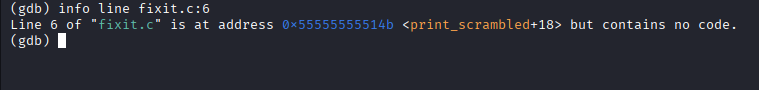
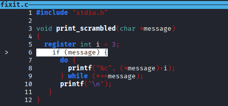
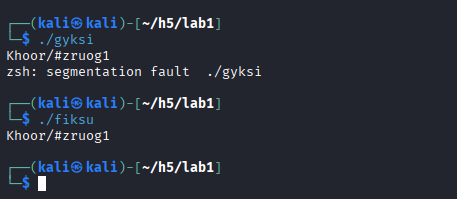
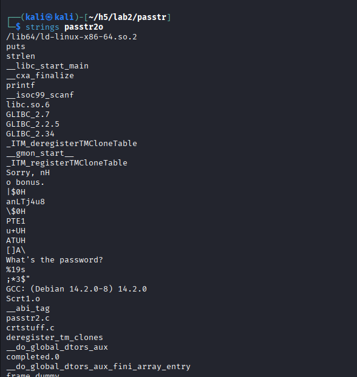
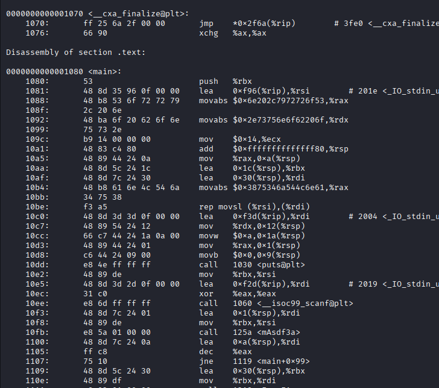
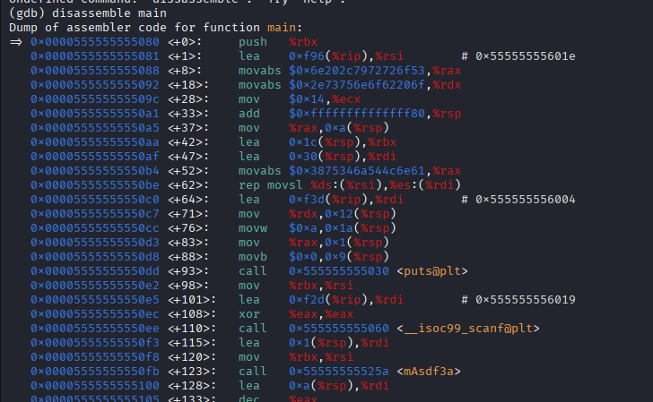
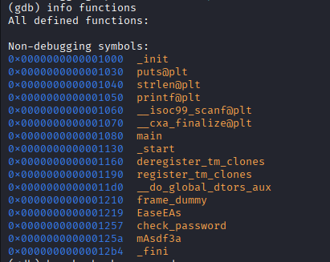

## h5 Se elää! (Lari)
https://terokarvinen.com/sovellusten-hakkerointi/#h5-se-elaa-lari

### a) Lab1. Tutkiminen mikä on ohjelmassa vialla ja miten se korjataan. 

En syysflunssan takia päässyt luennolle, joten tutustuin debuggaukseen itsekseni. YouTubesta löytyi mm. video, joka esitti graafisen tavan käydä läpi yhtä aikaa sekä lähdekoodia että assemblyä. https://www.youtube.com/watch?v=Dq8l1_-QgAc

Latasin tehtävän Lab1, jossa oli sisällä sekä lähdekoodi että binääri. 

Asensin gdb:n ja avasin tiedoston debuggerissa. Youtube-videon ohjeiden mukaan avasin tiedoston komennolla __layout split__ näkymään, jossa yläpuolella näkyi lähdekoodi ja alhaalla assembly. 

Asetin keskeytyspisteen main-ohjelman alkuun __break main__ ja ajoin sitten ohjelman komennolla __run__. Komennolla __next__ pääsin yhden rivin eteenpäin lähdekoodissa ja komennolla __step__ yhden rivin assemblyssä. 

Step-askelilla pääsin print_srambled-funktioon. Funktiolla on parametri char *message, jossa * tarkoittanee taas pointteria, eli konseptia johon en vielä ole ihan päässyt sisälle.

Menin nextillä eteenpäin, ja nyt ohjelma printtasi "Program received signal SIGSEV, Segmentation fault". 0x000055555555514f in print_scrambled" (message=0x0) at gdb_example1.c:7. Ongelma oli siis rivillä seitsemän.

Lähdekoodissa on siis funktio print_scrambled, joka saa parametrinä char-tyyppisen viestin, ja sitten do-while-loopissa tulostetaan viesti "skrämblättynä" niin, että alkuperäisen merkin sijasta tulostetaan kolmen merkin päässä oleva merkki, eli esimerkiksi a:n sijasta tulostettaisiin d.

Kun ohjelmaa ajoi, se ensin tulosti Khoor/#zruog1, eli ohjelman "good_message"-muuttujan arvon "Hello, world." skrämblättynä. Ohjelma kaatuu rivillä seitsemän "printf("%c", (*message)+i);", koska se saa parametrina NULL-arvon. 

Tein ohjelmasta kopion ja yritin korjata ongelman. Pari omaa kokeiluani epäonnistui, ensin virheilmoitukseen "comparison between pointer and interger", kun olin tehnyt tarkistuksen "if (message != NULL). Sitten kokeilin if (sizeof(*message > 0))., jolloin ohjelma hyppäsi koko rivin yli. Kysyin lopulta asiaa GPT:ltä, ja se selitti, että kyseessä on sellainen rakenne, että se on aina true, ja siksi ohjelman kääntäjä ei välitä siitä. ChatGPT:n neuvomalla komennolla __info line fixit.c:6__  näinkin, että kyseisen rivin assembly-koodissa ei ollut mitään. 

Korjasin koodin ChatGPT:n ohjeella lisäämällä tarkistuksen __if (message)__, eli ensin tarkistetaan, että viesti ei ole tyhjä.

Lopuksi testasin korjaamattomalla "gyksi"-ohjelmalla ja korjatulla "fiksu"-ohjelmalla, että bugi oli korjattu.   

### b) Lab2. Selvitä salasana ja lippu + kirjoita raportti siitä miten aukesi. 

Lab2-zip-tiedostossa näytti olevan sama ohjelma kuin aiemmassa tehtävässä eli passtr. Lisäksi siellä oli binääritiedosto passtr2o. README.md-tiedostossa kehotettiin selvittämään sen salasana. Ohjelma toimi samalla tavalla kuin passtr, eli kysyi "What's the password" ja sen jälkeen tarkisti sen.

Passtr2o-tiedoston mukana siis ei ollut lähdekoodia mukana vaan pelkkä binääri.  Stringsillä binääristä löytyi tuttu "What's the password?" ja muun muassa teksti "check_password".

Komennolla __objdump -d passtr2o__ näkyi kaikenlaista.

Olin aika pihalla ja kyselin ChatGPT:ltä erilaisia komentoja, joita kokeilin.

__disassemble main__ näyttää main-funktion asssemblyrivit  

__info functions__ näyttää funktiot  

En malttanut tutustua teoria-asioihin kunnolla, vaan enimmäkseen tappelin ChatGPT:n kanssa, jotta se selittäisi miten saisin esimerkiksi tutustuttua assemblyyn ilman, että koodi ajetaan ja ohjelma loppuu. Jossain vaiheessa sainkin sen toimimaan (mutta en enää muista miten, koska en kirjoittanut ohjeita ylös). Seuraavana päivänä vahingossa keksin, että assembly-ikkunaa pystyy skrollaamaan nuolinäppäimillä. Epäsystemaattisesti yritin sitä sun tätä, mutta kun ratkaisu ei mistään hypännyt silmään, niin lopulta luovutin.

### c) Lab3. Kokeile Nora Crackmes harjoituksia tehtävä 3 ja 4 ja loput vapaaehtoisia. Tindall 2023: NoraCodes / crackmes.
Luin Nora Crackmes -sivun ohjeista, että nämä tehtävät pitäisi tehdä ilman lähdekoodia. Kolmostehtävästä salasanan näkikin suoraan koodista. Vilkaisin binääriä debuggerissa, mutta sitten luovutin.
