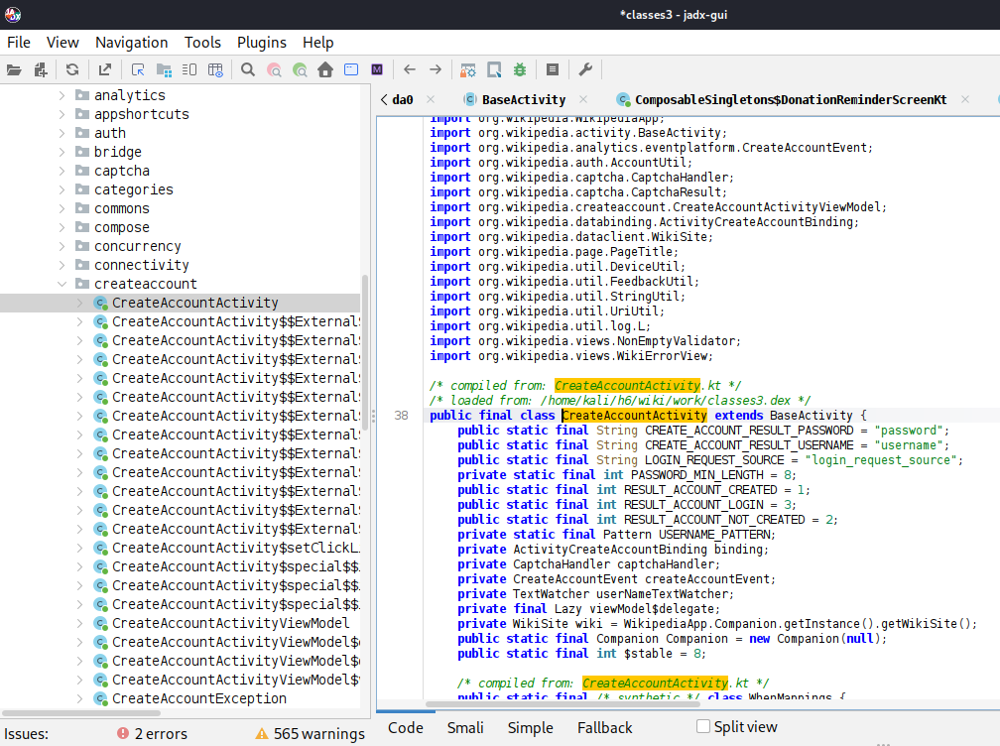

## h6 Sulaa hulluutta (Lari) 

Kaikissa tehtävissä käytin ChatGPT:tä mm. komentoihin.

### Lab0: Tutki tiedostoa h1.jpg, jo opituilla työkaluilla mitä saat selville?

Jotta pystyisin vertaamaan tiedostoa "normaaliin" jpg-tiedostoon, tallensin Wikimedia Commonsista kuvan, jonka nimeksi annoin "iso.jpeg".

File-työkalulla tiedostojen sisällöt näyttivät aika samanlaisilta:


Kaikissa vertailukuvissa h1.jpg on vasemmalla ja verrokkikuva oikealla.

Exiftoolin "htmlDump"-komennolla molempien kuvien tuloksissa näkyi paljon erilaista koodia, jonka voisi ajatella olevan jotain "hämärää" ja kuvaan piilotettua. Mutta koska koodit löytyivät myös verrokkikuvasta, niin ilmeisesti se onkin ihan normaalia jpg-kuvan metatietoa.


Ihan viimeisenä sitten löytyikin jotain oikeasti outoa, eli h1.jpg-tiedostosta "Unknown trailer".


Kokeilin vielä strings-työkalua. h1.jpg-kuvasta löytyi xml-tiedostoja ja jotain mikä päättyi merkkijonoon "xmlPK". ChatGPT sanoi sen viittaavan siihen, että siellä on Zip-tiedosto, jossa on sisällä xml-tiedostoja. 


### Lab1: Tutki tiedostoa h1.jpg binwalk (Versio 2.x tai 3.x huom toimivat eri tavalla), mitä tietoja löydät nyt tiedostosta. Mitä työkalua käyttäisit tiedostojen erottamiseen?

Kalissani oli binwalk valmiina, ja sen versio on "2.4.3+dfsg1-2", jonka ChatGPT selitti tarkoittavan, että se on Debianin/Kalin ylläpitäjien paketoima versio.

Käytin komentoa __binwalk --dd='.*'__ , joka löytyi YouTube-videolta https://www.youtube.com/watch?v=L0ae3y6FbJQ. 


Hakemistoon ilmestyi uusi hakemisto _h1.jpg.extracted. File-komennolla katsoin, minkälaisia tiedostoja siellä on. Katsomani YouTube-videon mukaan tiedosto "0" oli se alkuperäinen kuvatiedosto, ja siltä se näyttikin. Hakemistossa oli myös Microsoft Word 2007+ -dokumentti, tyhjä zip-tiedosto, toinen jpg-kuva, joka oli futuristinen maisema ja lisäksi kaksi "TIFF image data" -tiedostoa, jotka olivat kai vain kahden jpg-kuvan metadataa.


Yksi tiedostoista oli futuristinen kuva. 


Yritin kokeilla binwalk-työkalun entropia-toimintoa, mutta en saanut sitä toimimaan. 

Yritin unzipata Word-dokumentin, mutta se ei toiminut. ChatGPT neuvoi kokeilemaan 7z:aa, ja se toimi.  Ohjelma varoitti, että arkiston lopun jälkeen on vielä dataa.


Hakemistossa "docx_contents" oli muutama kansio, mm. kansio "word", johon GPT kehotti menemään. 

Siellä oli useita xml-tiedostoja, joista ChatGPT sanoi, että "document.xml" on itse tekstidokumentti. 

 

Xml-tiedostoa oli mahdotonta lukea, mutta GPT:n ohjeistamalla komennolla ```grep -oP '(?<=<w:t>).*?(?=</w:t>)'```  dokumentista löytyi tulevaisuuden ennustuksia.


### Lab2: FOSS (Free Android OpenSource) Tutustu listaan eri android applikaatioita.
#### https://github.com/offa/android-foss Valitse listalla itsellesi mielenkiintoisin applikaatio ja mene sen GitHubiin. Lataa ohjelman APK itsellesi ja käytä seuraavia työkaluja tutustuaksesi miten APK:n voi avata. ZIP, JADX ( https://github.com/skylot/jadx ), Bytecode-viewer ( https://github.com/Konloch/bytecode-viewer/ ) ####

Android-ohjelmista valitsin Wikipedia-sovelluksen. https://github.com/wikimedia/apps-android-wikipedia

#### ZIP
ChatGPT kertoi, että APK on "ZIP-arkisto, jossa on tietynlainen rakenne".  Unzippasin APK:n. Hakemistossa näkyi muun muassa classes.dex-tiedostoja. Ne sisältävät koodin, jonka Adroid voi sitten suorittaa. Lähde: https://diegomarcher.medium.com/a-comprehensive-guide-to-android-dex-compilation-and-execution-220f8cbb2034

 

Jadx-gui-työkalussa katsoin classes.dex-tiedostoja, ja työkalulla pystyy selaamaan ohjelman toimintoja, esim. tässä Wikipedia-tilin luominen.

 

