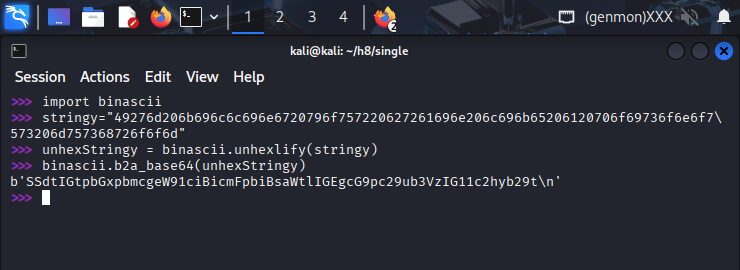
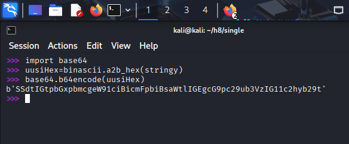
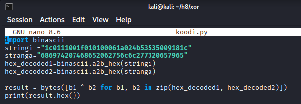
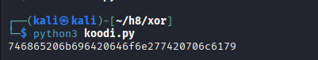

## h7 Uhagre2 (Tero)

### x) Lue/katso/kuuntele ja tiivistä.

_Schneier 2015: Applied Cryptography, 20ed: Chapter 1: Foundations:_  
_1.1 Terminology ("Historical Terms" loppuun)_  
_1.4 Simple XOR_  
_1.7 Large Numbers_  

- Kryptografiassa viestejä salataan (encryption) ja salaus puretaan (decryption)
- Salattu algoritmi ei ole hyvä, koska se täytyy pitää salassa, ja ongelmia tulee, jos se ei pysy salassa. Nykyään käytetään sen sijaan julkisia algoritmeja mutta salaisia avaimia.
- Symmetrisiä algoritmeja käytettäessä käytetään yhtä ja samaa salaista avainta 
- Julkisen avaimen (public-key) algoritmit käyttävät kahta eri avainta. Julkisella avaimella kuka tahansa voi salata viestin, ja ainoastaan yksityisen avaimen (private key) omaava henkilö voi purkaa salauksen.  
- Algoritmia pidetään vahvana, jos sitä ei pystytä murtamaan nykyisillä tai tulevaisuuden resursseilla.  
- XOR-operaatiossa verrataan bittejä, ja operaatio on totta jos bitit ovat erilaiset (toinen nolla ja toinen ykkönen)
- isojen lukujen hahmottamiseen voidaan käyttää esimerkiksi tällaisia arvioita: aika ennen seuraavaa jääkautta on non 14000 vuotta eli 2<sup>14</sup> ja atomien määrä universumissa 10<sup>77</sup> eli 2<sup>265</sup>

### Python basics for hackers
Karvinen 2024, https://terokarvinen.com/python-for-hackers/

- kannattaa testata pienillä paloilla usein, esimerkiksi python3- tai ipython3:lla voi ajaa suoraan komentoriviltä
- ord("T") printtaa T:n ASCII numeron (84) ja chr(84) tekee toiseen suuntaan, eli printtaa 'T'
- hex(84) printtaa '0x54' ja bin(84) printtaa '0b1010100'
- for in -rakenteella on helppo käydä läpi listoja
- hyödyllisiä kirjastoja binascii, base64

## Cryptopals set 1  
https://cryptopals.com/sets/1

Olen käyttänyt tehtävissä ChatGPT 5.0 -tekoälyä kyselemällä siltä "hex-termeistä" yms., ja pyytänyt sitä kertomaan, onko koodini oikein. Oman oppimiseni vuoksi olen pyrkinyt kirjoittamaan loppuratkaisun auki.


## a) 1. Convert hex to base64.

Tehtävässä piti muuttaa hex-string base64-stringiksi. Sääntönä on, että pitää operoida tavuilla eikä enkoodatuilla stringeillä.

Tein ensin niin, että loin stringin, josta tein  `binascii.unhexlify(stringy)`. Siitä tuli ulos b"I'm killing your brain like a poisonous mushroom".
Sen jälkeen tein `binascii.b2a_base64(unhexStringy)`, josta tuli haluttu string.



Sekoilin tämän kanssa aika kauan, mutta opinhan ainakin sen, että unhexflify() ja a2b_hex() ovat sama asia, ja base64.b64encode() ja binascii.b2a_based64() tekevät saman asian, mutta jälkimmäinen lisää loppuun uuden rivin.



Alemman kuvan selitys: ensimmäinen a2b_hex() muuttaa hex-enkoodatun stringin tavuiksi.

Seuraavaksi base64.b64encode() ottaa tavut ja muuttaa ne base64-enkoodatuksi stringiksi. 

Base64:ssa on 64 symbolia. Ensin string muutetaan tavuiksi (8 bittiä), minkä jälkeen tavut ryhmitellään kolmen tavun ryhmiksi, ja jokaisen ryhmän (24 bittiä) bitit jaetaan neljään kuuden bitin ryhmään. Ne muutetaan desimaaliarvoksi, joita on maksimissaan 64 koska 0011 1111 on 63. Jokaiselle 64 arvolle on oma merkkinsä base64:ssa, eli pienet ja isot kirjaimet, numerot 0-9 ja "+" ja "/. Jos kuuden bitin jaottelu ei mene tasan, niin laitetaan täytteeksi yhtäsuuruus-merkkejä (padding).

### b) 2. Fixed XOR

Tehtävässä piti tehdä funktio, joka ottaa kaksi yhtä pitkää stringiä ja tekee niiden XOR-yhdistelmän. 

Eli annettu string on siis hex-enkoodattu (esim. ensimmäinen tavu on 1c) ja se pitäisi hex-dekoodata.

Jossain vaiheessa luin tehtävään annetut vinkit. 

Tein 
```
stringi ="1c0111001f010100061a024b53535009181c"
hex_decoded=binascii.a2b_hex(stringi)
for c in hex_decoded:
        print (c)
```
jolloin ohjelma printtasi  
28

1

17

0...

ChatGPT selitti, että jokainen c on luku väliltä 0-255 ja esittää yhtä tavua. Eli jos pystyn printtaamaan tavun (integerinä), niin sitten vaan seuraavaksi käymään läpi kaksi listaa, joiden integer-tavut XORataan keskenään.

Lueskelin muun muassa tätä https://www.geeksforgeeks.org/python/enumerate-in-python/

kokeilin tällaista:
```
import binascii
stringi ="1c0111001f010100061a024b53535009181c"
stranga="686974207468652062756c6c277320657965"
hex_decoded1=binascii.a2b_hex(stringi)
hex_decoded2=binascii.a2b_hex(stranga)

for i, byte in enumerate(hex_decoded1):
        for char in(hex_decoded2):
                bytes([byte ^ byte(hex_decoded2(i) for byte in hex_decoded1])
```
				
Sain virheilmoituksen, ja ChatGPT nauroi koodilleni.

Se korjasi koodini: 

```
import binascii
stringi ="1c0111001f010100061a024b53535009181c"
stranga="686974207468652062756c6c277320657965"
hex_decoded1=binascii.a2b_hex(stringi)
hex_decoded2=binascii.a2b_hex(stranga)

result = bytes([b1 ^ b2 for b1, b2 in zip(hex_decoded1, hex_decoded2)])
print(result.hex())
```

  


Eli.
1. Muutetaan kaksi hex-stringiä tavuiksi (a2b_hex)
2. hex_decoded1 ja 2 ovat bytes-objekteja
3. zip-funktiolla voidaan iteroida kaksi listaa yhtä aikaa (https://realpython.com/python-zip-function/). Tavujen läpi iterointi antaa tavun (integer) ja bitwise XOR niiden välillä tuottaa myös integerin (per ChatGPT).
4. Bytes-funktiolla luodaan tavujen sarja https://www.geeksforgeeks.org/python/python-bytes-method/
5. Lopuksi bytes.hex()-tyyppinen metodi muuttaa tavusarjan/objektin heksadesimaali-stringiksi. (https://www.geeksforgeeks.org/python/bytes-hex-method-python/)


### c ja d 
Tutustuin tehtäviin, mutta en tehnyt niitä.
